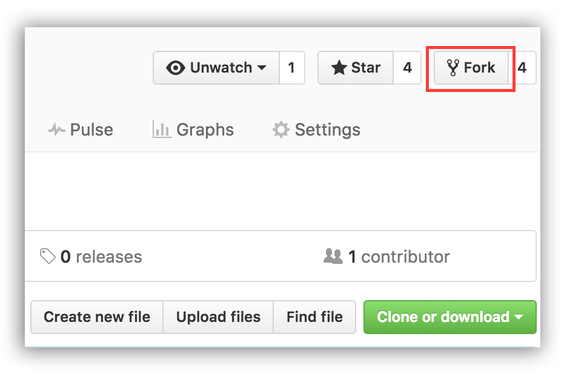

# Quick Start Guide - New AppWrite Contributors 🎯


<br/>

## *We know the process of creating a pull request is the biggest barrier for new contributors, we created very simple contributor-friendly issues to help onboard more people to become Open Source contributors.*


<br/>

## **Who is for?** 🤔
- Folks who haven't contributed to AppWrite codebase before.
- People who are looking to make first contribution to Open Source.


##  **What you will need to know?**

- **Nothing! _We are happy to walk you through the process (:_**   
- Our communnity willing to hold your hand so you can make your first PR
<br/>


#  Step By Step 📋 
### We wanted to create very simple contributor-friendly **issues** to help more people to become Open Source contributors for the first time in our project
<br/>




## Fork this repository

Fork this repository by clicking on the fork button on the top of this page.
This will create a copy of this repository in your account.

## Clone the repository


Now clone the forked repository to your machine. Go to your GitHub account, open the forked repository, click on the clone button and then click the _copy to clipboard_ icon.

Open a terminal and run the following git command:

```
git clone "url you just copied"
```

where "url you just copied" (without the quotation marks) is the url to this repository (your fork of this project). See the previous steps to obtain the url.


For example:

```
git clone https://github.com/this-is-you/first-contributions.git
```

where `this-is-you` is your GitHub username. Here you're copying the contents of the first-contributions repository on GitHub to your computer.

<br/>


## Make necessary changes and commit those changes

Now open `appwrite-contributors.md` file in a text editor, add your name to it. Don't add it at the beginning or end of the file. Put it anywhere in between. Now, save the file.


If you go to the project directory and execute the command `git status`, you'll see there are changes.

Add those changes using the `git add` command:

```
git add Contributors.md
```

Now commit those changes using the `git commit` command:

```
git commit -m "Add <your-name> to Contributors list"
```

replacing `<your-name>` with your name.

## Push changes to GitHub

Push your changes using the command `git push`:

```
git push
```

## Submit your changes for review

If you go to your repository on GitHub, you'll see a `Compare & pull request` button. Click on that button.


## Start a Pull Request

Now submit the pull request, click on `Create pull request`.


Soon I'll be merging all your changes into the master branch of this project. You will get a notification email once the changes have been merged.
